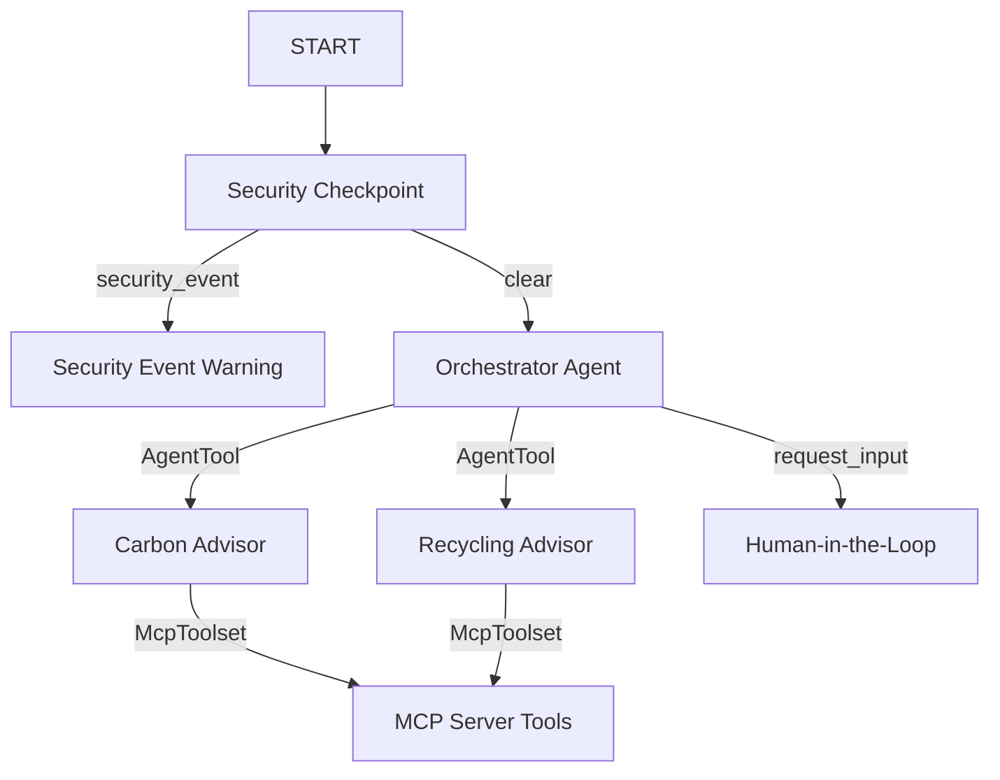

# eco-advisor

An intelligent ecological assistant that helps users reduce their carbon footprint, discover recycling options, and adopt eco-friendly alternatives.

## Prerequisites

- Python 3.11 or higher
- [uv](https://astral.sh/uv) (Python package manager)
- Gemini API Key from [google.aistudio.com/apikey](https://aistudio.google.com/apikey)

## Quick Start

```bash
git clone <repo-url>
cd eco-advisor
cp .env.example .env   # add your GOOGLE_API_KEY
make install
make playground        # opens UI at http://localhost:18081
```

## Architecture

The `eco-advisor` is implemented as an ADK 2.0 Workflow graph that filters user inputs through a security checkpoint before routing them to a multi-agent orchestration team equipped with specialized tools over an MCP server.



## How to Run

- **Interactive Playground (Dev UI)**:
  ```bash
  make playground
  ```
  Access the web interface at [http://localhost:18081](http://localhost:18081) to chat with the agents.

- **Local Production Web Server**:
  ```bash
  make run
  ```
  Runs the FastAPI server at [http://localhost:8000](http://localhost:8000).

- **Run Tests**:
  ```bash
  make test
  ```

## Sample Test Cases

### Case 1: Carbon Footprint Calculation
- **Input**: `"Calculate carbon footprint for 150 driving miles"`
- **Expected Outcome**: The `orchestrator` delegates the calculation to the `carbon_advisor` sub-agent. The `carbon_advisor` calls the `calculate_carbon_footprint` MCP tool and outputs: `"Activity: driving_miles, Quantity: 150. Estimated carbon impact: 60.60 kg CO2."`
- **Check**: View the streaming chat response in the Playground UI and see `INFO` audit log in uvicorn console showing clear safety status.

### Case 2: Eco-friendly Alternatives Recommendation
- **Input**: `"Suggest an eco-friendly alternative for plastic water bottles"`
- **Expected Outcome**: The `orchestrator` delegates to the `carbon_advisor` sub-agent. The `carbon_advisor` calls `search_eco_products` and responds suggesting food-grade stainless steel or glass bottles instead of single-use plastics.
- **Check**: Response is rendered in the chat window, and execution traces verify `carbon_advisor` successfully called the `search_eco_products` tool.

### Case 3: Composting sorting rules (HITL)
- **Input**: `"Can I compost a paper towel?"`
- **Expected Outcome**: The `orchestrator` routes to the `recycling_advisor` sub-agent, which calls `get_composting_guideline` and responds: `"'paper towel' is Brown Compostable. Tear into small pieces..."`
- **Check**: Response is generated and displayed on screen.

## Troubleshooting

1. **429 RESOURCE_EXHAUSTED / Quota limit exceeded**:
   - The default model `gemini-2.5-flash` has a free-tier limit of 20 requests per day.
   - **Fix**: Open `.env` and set `GEMINI_MODEL=gemini-2.5-flash-lite`, which allows up to 1,500 requests per day on the free tier.
2. **403 PermissionDenied for Google Cloud Services**:
   - The server tries to connect to Vertex AI or GCP Logging when GCP credentials are not initialized.
   - **Fix**: The codebase has an integrated fallback that automatically detects when Application Default Credentials are mock/missing and redirects all logs and telemetry to standard Python console logs.
3. **No Agents Found / Directory Error on Windows**:
   - Running `adk web` with wildcard expansions or the wrong source folder fails.
   - **Fix**: Run the command with `app` explicitly as the directory target (e.g. `uv run adk web app ...`), which is already configured in the Makefile target.

## Push to GitHub

1. Create a new repo at https://github.com/new
   - Name: eco-advisor
   - Visibility: Public or Private
   - Do NOT initialize with README (you already have one)

2. In your terminal, navigate into your project folder:
   cd eco-advisor
   git init
   git add .
   git commit -m "Initial commit: eco-advisor ADK agent"
   git branch -M main
   git remote add origin https://github.com/<your-username>/eco-advisor.git
   git push -u origin main

3. Verify .gitignore includes:
   .env          ← your API key — must NEVER be pushed
   .venv/
   __pycache__/
   *.pyc
   .adk/

⚠ NEVER push .env to GitHub. Your API key will be exposed publicly.

## Demo Script

Refer to the demo script detailing spoken presentation narration and screen instructions: [DEMO_SCRIPT.txt](DEMO_SCRIPT.txt)
