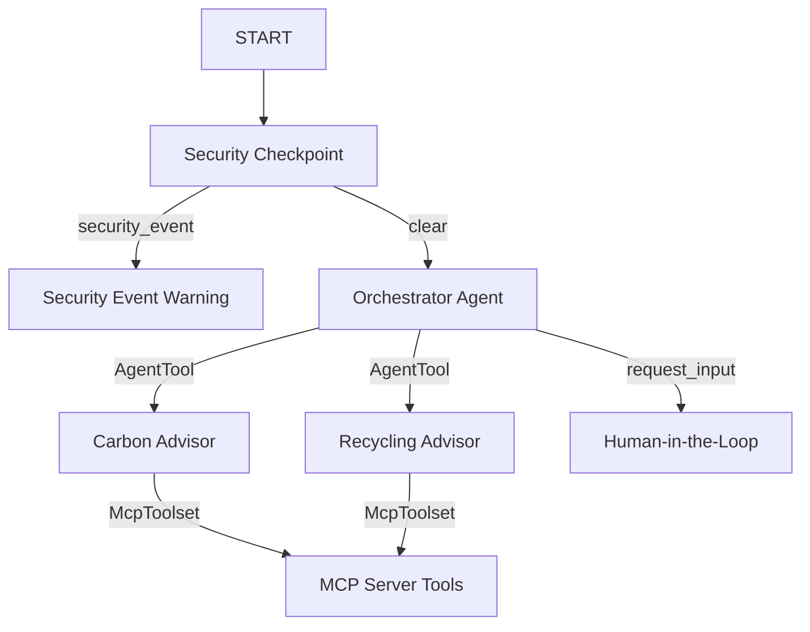

# Submission Writeup — eco-advisor

## Problem Statement

As global awareness of climate change and environmental degradation increases, individuals and businesses are eager to make more sustainable choices. However, translating this desire into concrete actions is challenging. Practical knowledge is fragmented: determining the carbon impact of a flight, understanding complex local recycling sorting rules (e.g. for batteries or compost vs landfill), and finding eco-friendly product alternatives requires extensive manual research.

`eco-advisor` solves this by offering a conversational AI assistant that acts as a single point of truth for sustainability. It combines specialized reasoning sub-agents (carbon and recycling experts) with direct system tools to retrieve and compute precise answers instantly, encouraging sustainable daily habits.

## Solution Architecture

The system is designed code-first using the Google Agent Development Kit (ADK) 2.0. Every input flows through a security node before reaching the orchestrator.

## Concepts Used

- **ADK Workflow**: Declarative graph-based state management that defines the step-by-step logic of our agent. (Defined in [app/agent.py](app/agent.py) as `eco_advisor_workflow`).
- **LlmAgent**: Three specialized agents are declared using `LlmAgent` for task-focused reasoning: `orchestrator`, `carbon_advisor`, and `recycling_advisor` (Defined in [app/agent.py](app/agent.py)).
- **AgentTool**: Used by the `orchestrator` to delegate requests to either `carbon_advisor` or `recycling_advisor` dynamically based on user needs (Defined in [app/agent.py](app/agent.py)).
- **MCP Server**: Implements the Model Context Protocol to host external tools and interface them directly with our agents. (Implemented in [app/mcp_server.py](app/mcp_server.py) and loaded in [app/agent.py](app/agent.py) as `mcp_toolset`).
- **Security Checkpoint**: A workflow function node (`security_checkpoint`) placed at the start of the execution to enforce safety protocols (Defined in [app/agent.py](app/agent.py)).
- **Agents CLI**: Project scaffolded using `agents-cli scaffold create` and operated via `uv run adk web app` (Configured in [Makefile](Makefile)).

## Security Design

The security gateway in `security_checkpoint` runs before any LLM execution to protect user privacy and system integrity:
1. **PII Scrubbing**: Sanitizes email addresses and phone numbers from user messages using regex patterns, replacing them with generic placeholders to prevent private data from being sent to external LLM APIs.
2. **Prompt Injection Mitigation**: Scans user inputs for command override keywords (e.g. "ignore previous instructions") and immediately routes the request to a fallback warning state (`security_event`), aborting the workflow.
3. **Structured Audit Log**: Prints a structured JSON audit payload for every transaction, capturing security status (clear/blocked), PII markers, and severity (`INFO`, `WARNING`, `CRITICAL`) for system monitoring.
4. **Domain Filtering**: Rejects queries containing dangerous topics (e.g., "bomb", "hack", "illegal") to restrict usage to positive environmental topics.

## MCP Server Design

The Model Context Protocol (MCP) server runs via standard I/O (stdio transport) and exposes four domain-specific tools:
- `calculate_carbon_footprint`: Multiplies mileage, electricity usage, or flight hours by standardized carbon emission constants (in kg CO2) to perform math reliably.
- `get_recycling_rules`: Translates material types (plastic, metal, electronics) into actionable sorting rules.
- `search_eco_products`: Maps standard product categories (water bottle, detergent) to eco-friendly, plastic-free alternatives.
- `get_composting_guideline`: Identifies if an item is green/brown compostable or should be excluded from home composting.

By moving these calculations and mappings to MCP tools, we avoid common LLM hallucinations in arithmetic calculations and data lookup.

## Human-in-the-Loop (HITL) Flow

When a user query is ambiguous (e.g. asking to "calculate carbon footprint" without specifying the activity type or miles), the `orchestrator` agent calls the `request_input` tool. The workflow pauses execution, prompting the user for clarification in the playground interface. Once the user enters the missing parameters, the workflow resumes and processes the request.

## Demo Walkthrough

The project includes three pre-configured test scenarios demonstrated in the playground:
- **Test Case 1 (Carbon Calculation)**: Asking `"Calculate carbon footprint for 150 driving miles"` routes to `carbon_advisor`, calls the `calculate_carbon_footprint` MCP tool, and outputs that 150 miles emits ~60.60 kg CO2.
- **Test Case 2 (Eco Alternatives)**: Asking `"Suggest an eco-friendly alternative for plastic water bottles"` returns suggestions for stainless steel and glass alternatives via `search_eco_products`.
- **Test Case 3 (Composting Rules)**: Asking `"Can I compost a paper towel?"` returns instructions on brown composting via `get_composting_guideline`.

## Impact / Value Statement

`eco-advisor` empowers individuals to make informed daily decisions that reduce their environmental impact. By providing instant, clear, and verified answers on recycling and carbon metrics, it lowers the barrier to green living and helps communities achieve zero-waste goals one step at a time.
